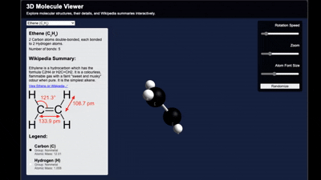

This project was entirely AI generated, using some basic prompts, and conversation with GitHub Copilot, Hugging Face Anychat with Deepseek and Google Gemini. I wrote no code directly at all. I know little about elements or chemistry so this may be inaccurate - which was an interesting part of the experiment. There are many possible refinements and optimisation. 

To see the code live go here: https://danamini.github.io/molecule-viewer/ 

Everything after this is AI generated...

# 3D Molecule Viewer

## Overview
The 3D Molecule Viewer is a web application that allows users to explore molecular structures interactively. It utilizes Three.js for rendering 3D graphics and provides features such as rotation, zooming, and displaying molecular details.

## Features
- Interactive 3D visualization of molecules
- Dynamic selection of different molecules
- Display of molecular details and Wikipedia summaries
- Adjustable rotation speed and zoom level
- Random molecule selection feature

## Installation
1. Clone the repository:
   git clone https://github.com/yourusername/molecule-viewer.git
2. Navigate to the project directory:
   cd molecule-viewer
3. Open `home.html` in a web browser to view the application.

## Usage
- Select a molecule from the dropdown menu to view its 3D structure.
- Use the sliders to adjust the rotation speed and zoom level.
- Click the "Randomize" button to view a random molecule.

## Contributing
Contributions are welcome! Please open an issue or submit a pull request for any enhancements or bug fixes.

## License
This project is licensed under the MIT License. See the LICENSE file for details.
